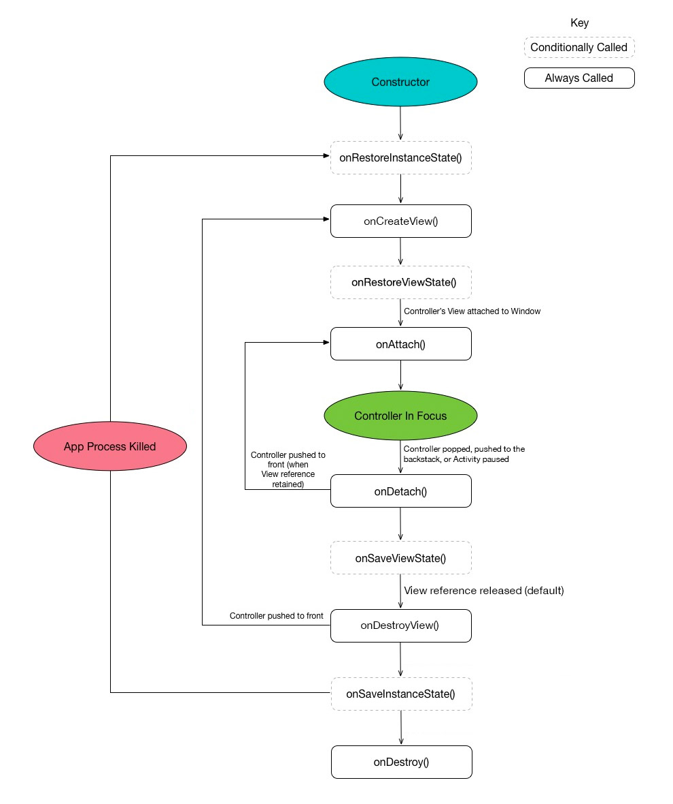

[](https://travis-ci.org/bluelinelabs/Conductor) [](http://android-arsenal.com/details/1/3361)

# Conductor

A small, yet full-featured framework that allows building View-based Android applications. Conductor provides a light-weight wrapper around standard Android Views that does just about everything you'd want:

              |  Conductor
------|------------------------------
:tada: | Easy integration
:point_up: | Single Activity apps without using Fragments
:recycle: | Simple but powerful lifecycle management
:train: | Navigation and backstack handling
:twisted_rightwards_arrows: | Beautiful transitions between views
:floppy_disk: | State persistence
:phone: | Callbacks for onActivityResult, onRequestPermissionsResult, etc
:european_post_office: | MVP / MVVM / VIPER / MVC ready

Conductor is architecture-agnostic and does not try to force any design decisions on the developer. We here at BlueLine Labs tend to use either MVP or MVVM, but it would work equally well with standard MVC or whatever else you want to throw at it.

## Installation

```gradle
compile 'com.bluelinelabs:conductor:1.1.4'

// If you want the components that go along with
// Android's support libraries (currently just a PagerAdapter):
compile 'com.bluelinelabs:conductor-support:1.1.4'

// If you want RxJava/RxAndroid lifecycle support:
compile 'com.bluelinelabs:conductor-rxlifecycle:1.1.4'
```

## Components to Know

              |  Conductor Components
------|------------------------------
__Controller__ | The Controller is the View wrapper that will give you all of your lifecycle management features. Think of it as a lighter-weight and more predictable Fragment alternative with an easier to manage lifecycle.
__Router__ | A Router implements navigation and backstack handling for Controllers. Router objects are attached to Activity/containing ViewGroup pairs. Routers do not directly render or push Views to the container ViewGroup, but instead defer this responsibility to the ControllerChangeHandler specified in a given transaction.
__ControllerChangeHandler__ | ControllerChangeHandlers are responsible for swapping the View for one Controller to the View of another. They can be useful for performing animations and transitions between Controllers. Several default ControllerChangeHandlers are included.
__ControllerTransaction__ | Transactions are used to define data about adding Controllers. RouterControllerTransactions are used to push a Controller to a Router with specified ControllerChangeHandlers, while ChildControllerTransactions are used to add child Controllers.

## Getting Started

### Minimal Activity implementation

```java
public class MainActivity extends Activity {

    private Router mRouter;

    @Override
    protected void onCreate(Bundle savedInstanceState) {
        super.onCreate(savedInstanceState);

        setContentView(R.layout.activity_main);

        ViewGroup container = (ViewGroup)findViewById(R.id.controller_container)

        mRouter = Conductor.attachRouter(this, container, savedInstanceState);
        if (!mRouter.hasRootController()) {
            mRouter.setRoot(new HomeController());
        }
    }

    @Override
    public void onBackPressed() {
        if (!mRouter.handleBack()) {
            super.onBackPressed();
        }
    }

}
```

### Minimal Controller implementation

```java
public class HomeController extends Controller {

    @Override
    protected View onCreateView(@NonNull LayoutInflater inflater, @NonNull ViewGroup container) {
        View view = inflater.inflate(R.layout.controller_home, container, false);
        ((TextView)view.findViewById(R.id.tv_title)).setText("Hello World");
        return view;
    }

}
```

### Sample Project

[Demo app](https://github.com/bluelinelabs/conductor/tree/master/demo) - Shows how to use all basic and most advanced functions of Conductor.

### Controller Lifecycle

The lifecycle of a Controller is significantly simpler to understand than that of a Fragment. A lifecycle diagram is shown below:



## Advanced Topics

### Retain View Modes
`setRetainViewMode` can be called on a `Controller` with one of two values: `RELEASE_DETACH`, which will release the `Controller`'s view as soon as it is detached from the screen (saves memory), or `RETAIN_DETACH`, which will ensure that a `Controller` holds on to its view, even if it's not currently shown on the screen (good for views that are expensive to re-create).

### Custom Change Handlers
`ControllerChangeHandler` can be subclassed in order to perform different functions when changing between two `Controllers`. Two convenience `ControllerChangeHandler` subclasses are included to cover most basic needs: `AnimatorChangeHandler`, which will use an `Animator` object to transition between two views, and `TransitionChangeHandler`, which will use Lollipop's `Transition` framework for transitioning between views.

### Child Controllers
`addChildController` can be called on a `Controller` in order to add nested `Controller`s. Child `Controller`s will receive all lifecycle callbacks that parents get.

### RxJava Lifecycle
If the RxLifecycle dependency has been added, there is an `RxController` available that can be used along with the standard [RxLifecycle library](https://github.com/trello/RxLifecycle). There is also a `ControllerLifecycleProvider` available if you do not wish to use this subclass. 

## License
```
Copyright 2016 BlueLine Labs, Inc.

Licensed under the Apache License, Version 2.0 (the "License");
you may not use this file except in compliance with the License.
You may obtain a copy of the License at

   http://www.apache.org/licenses/LICENSE-2.0

Unless required by applicable law or agreed to in writing, software
distributed under the License is distributed on an "AS IS" BASIS,
WITHOUT WARRANTIES OR CONDITIONS OF ANY KIND, either express or implied.
See the License for the specific language governing permissions and
limitations under the License.
```
